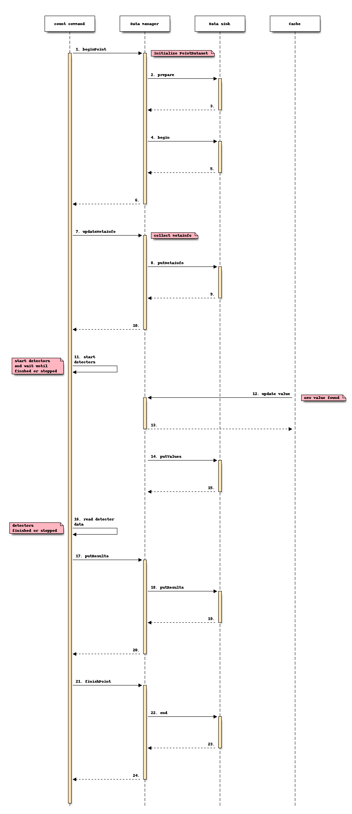

========
Data API
========

.. module:: nicos.core.data.sink
   :noindex:

--------
Overview
--------

.. digraph:: DataAPI

    rankdir = LR;

    subgraph cluster0 {
        node [style=filled,color=white];
        style = "rounded,filled";
        color = lightsalmon;

        "commands" {rank = same; "data-manager";}
        "detectors" {rank = same; "devices";}
        "data-sets" {rank = same; "data-sinks"}

        "devices" -> "data-manager";
        "detectors" -> "data-manager";
        "commands" -> "data-manager";
        "data-manager" -> "data-sets";
        "data-sets" -> "data-sinks";

    }

The data handling in NICOS is split into three main parts:

 - The commands, which are intended to write data files, interact with the data
   manager and this will interact with the data sinks.

 - The :ref:`data sinks <data_sinks>` may write data into file, transfer the
   data (for example to a preview), or do nothing with the data.

 - The :ref:`data manager <data_manager>` collects the data from the detector(s)
   as well as the data from the different devices (as so called metadata).  The
   collected data and metadata will be stored in :ref:`data sets <data_sets>`.
   The data manager sends exactly these data sets to data sinks where they will
   be analyzed and handled.

Each data sink handles the data sent from the data manager individually.  It is
not only how the data will be treated, but also which type of data set it
handles.  This selection will be done via the :attr:`~DataSink.settypes`
parameter of each data sink and can be activated for the different types of data
sets.

These data sets are different for a scan, a subscan, or a single count command.

---------------------------------------------------
Interaction of commands with data manager and sinks
---------------------------------------------------

Count command
~~~~~~~~~~~~~

.. module:: nicos.commands.measure
   :noindex:

If the user calls the :func:`~count` command in NICOS the following happens:

   Interaction of count command, data manager, and data sink

Scan commmand
~~~~~~~~~~~~~

.. module:: nicos.commands.scan
   :noindex:

In case of calling the :func:`~scan` or related command there is the following
interaction between the components:

.. figure:: dataapi-scan.png

   Interaction of a scan command, data manager, and data sink

----------
Components
----------

.. toctree::
   :maxdepth: 1

   datamanager
   datasets
   datasinks
