.. _gui-config:

GUI configuration
=================

The layout of the GUI client can be configured very extensively with the help of
a configuration file usually called ``custom/<instrument>/guiconfig.py`` (another
such file can be selected at startup with the ``-c`` option).

The configuration file is a Python module that uses several special functions
that together describe the lay-out of Qt panels and windows.

.. _gui-config-example:

A small example configuration file looks like this:

.. code-block:: python
   :linenos:

   main_window = docked(
       vsplit(
           panel('nicos.clients.gui.panels.status.ScriptStatusPanel'),
           panel('nicos.clients.gui.panels.console.ConsolePanel'),
       ),
       ('NICOS devices', panel('nicos.clients.gui.panels.devices.DevicesPanel',
                               icons=True, dockpos='right'))
   )

   windows = [
       window('Editor', 'editor',
           vsplit(
               panel('nicos.clients.gui.panels.scriptbuilder.CommandsPanel'),
               panel('nicos.clients.gui.panels.editor.EditorPanel'),
           )
       ),
       window('Scans', 'plotter', panel('nicos.clients.gui.panels.scans.ScansPanel')),
   ]

   tools = [
       tool('Calculator', 'nicos.clients.gui.tools.calculator.CalculatorTool'),
       tool('Report NICOS bug', 'nicos.clients.gui.tools.website.WebsiteTool',
            url='http://forge.frm2.tum.de/redmine/projects/nicos/issues/new'),
   ]
   options = {'reader_classes': ['nicos_mlz.demo.demo_file.DemoReader']}

There must be three top-level values called ``main_window``, ``windows`` and
``tools``.

``main_window`` is the panel configuration for the main window, the other window
configurations must be created by ``window()`` and contain panel configurations
for auxiliary windows that can be opened from the GUI's toolbar and "Windows"
menu.

The ``tools`` entry specifies a list of tools that can be run from the GUI's
"Tools" menu.  They should be small, short-lived dialogs that typically do not
stay open for very long.

The ``options`` entry is a dict for further configuration.
Currently ``reader_classes`` is supported for loading custom image readers.

Panel combinators
-----------------

The basic building blocks for windows (main and auxiliary) are :ref:`panels<panels>`.
Windows can consist of single panels, or multiple panels combined in several
ways.

The functions to combine several panels are:

.. function:: docked(main, *rest)

   Creates a main panel, with several docks.  The first argument is the main
   panel (or another combination of panels), while the rest of the arguments are
   tuples of ``(dockname, panelconf)``, as in the example config above.

   This must be the toplevel element for a window, it should not be a child
   element.

.. function:: tabbed(*tabs)

   Creates a tab widget (with tabs that can be reordered and dragged out of the
   widget as separate windows).  The arguments are tuples of ``(tabname,
   panelconf)``.  This can be used as the "main" element of a ``docked``
   configuration.

.. function:: hsplit(*confs, **options)

   Creates a layout of panel configurations separated horizontally by splitters.

   Options:

   * The ``setups`` options gives the possibility to define a setup depending
     display of the panels, see :ref:`gui-config-setup`

.. function:: vsplit(*confs, **options)

   Creates a layout of panel configurations separated vertically by splitters.

   Options:

   * The ``setups`` options gives the possibility to define a setup depending
     display of the panels, see :ref:`gui-config-setup`

.. _gui-config-setup:

Setup depending configuration
-----------------------------

For some reason it would be nice to display some elements in the GUI or status
monitor only in case of some loaded or not loaded setups.

To solve this problem you may use the ``setups`` option which could given for the
:func:`panel` entries in the GUI configuration files as well as for the
:func:`Block` entries in the status monitor configuration files.

The syntax of the setups is the following:

 * names of the setups as a string
 * an exclamation mark ``!`` or a ``not`` in front of the setup name inverts the
   meaning
 * setup names could be combined with the keywords ``and`` and ``or``.
 * as wildcard an asterisk ``*`` is used.
 * brackets may be used to group the experessions

If a simple name is given the setup condition is fulfilled if the setup is loaded
in the NICOS :term:`master`.  Otherwise you can use Python boolean operators and
parentheses to construct an expression like ``(setup1 and not setup2) or setup3``

To match multiple setups, use filename patterns, for example: ``ccr* and not cryo*``.

Examples:
^^^^^^^^^

 * 'biofurnace' - gives True if this setup is loaded, otherwise False
 * '!biofurnace' - gives False if this setup is loaded, otherwise True
 * 'ccr*' - gives True if any setup is loaded which name starts with 'ccr',
   otherwise False
 * '!ccr*' - gives False if any setup is loaded which name starts start with 'ccr',
   otherwise True
 * ['biofurnace', '!ccr*'], 'biofurnace and !ccr*', 'biofurnace and not ccr*' - these
   notations are equivalent and give True if the 'biofurnace' setup is loaded
   but not any starting with 'ccr', otherwise False
 * 'biofurnace and not ccr01' - gives True if the 'biofurnace' setup is loaded but
   not the 'ccr01' setup, otherwise False
 * '(biofurnace and not (ccr01 or htf01)' - gives True if the 'biofurnace' setup
   is loaded but not any of 'ccr01' or 'htf01', otherwise False

.. _panels:

Panels
------

The function to create a single panel is:

.. function:: panel(classname, **options)

   This creates a single panel of class ``classname``.  The class name must be
   fully qualified with the module name to import it from.

   See :ref:`the example config above <gui-config-example>`.

   Options:

   * The ``setups`` options gives the possibility to define a setup depending
     display of the panels, see :ref:`gui-config-setup`

   * The ``dockpos`` options is only used if the panel is part of the
     :func:`docked` panel and give the default position insight a dock widget.

     The values could be:
        - left
        - right
        - top
        - bottom

   The other possible ``options`` are panel-specific; the keywords given here
   are passed to the panel.

Each panel is implemented by a class inheriting from
``nicos.clients.gui.panels.Panel`` and usually a Designer ``.ui`` file.  See
:ref:`gui-panels` for a description of the panel interface.

Panels can provide menus and toolbars; these are all collected by the window
they are displayed in.

Delivered panels
----------------

Panels that come with NICOS are:

.. autoclass:: nicos.clients.gui.panels.console.ConsolePanel()

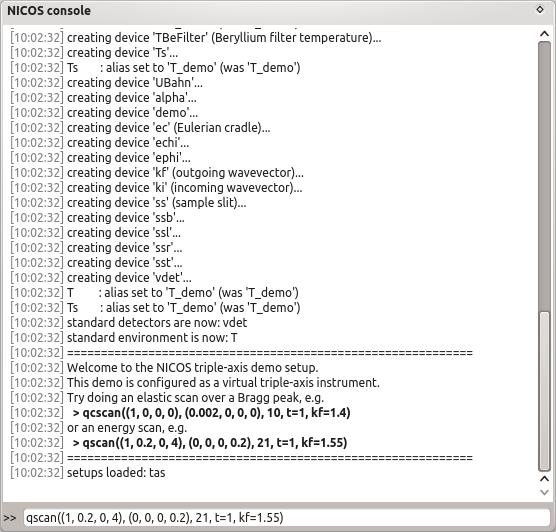

.. autoclass:: nicos.clients.gui.panels.commandline.CommandLinePanel()

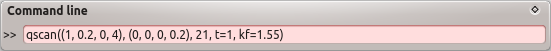

.. _commandbuilder-commandpanel:

.. autoclass:: nicos.clients.gui.panels.cmdbuilder.CommandPanel()

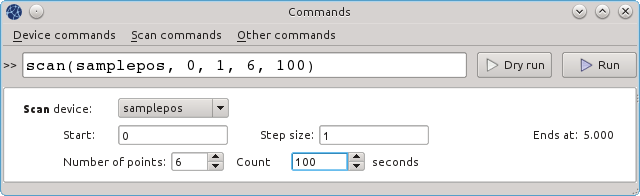

.. autoclass:: nicos.clients.gui.panels.devices.DevicesPanel()

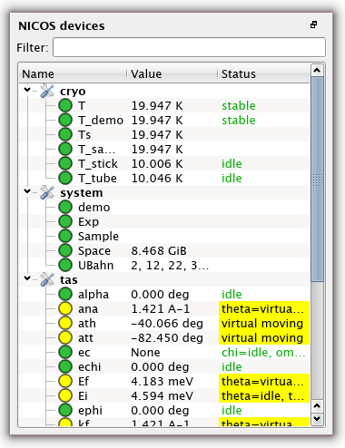

.. autoclass:: nicos.clients.gui.panels.editor.EditorPanel()

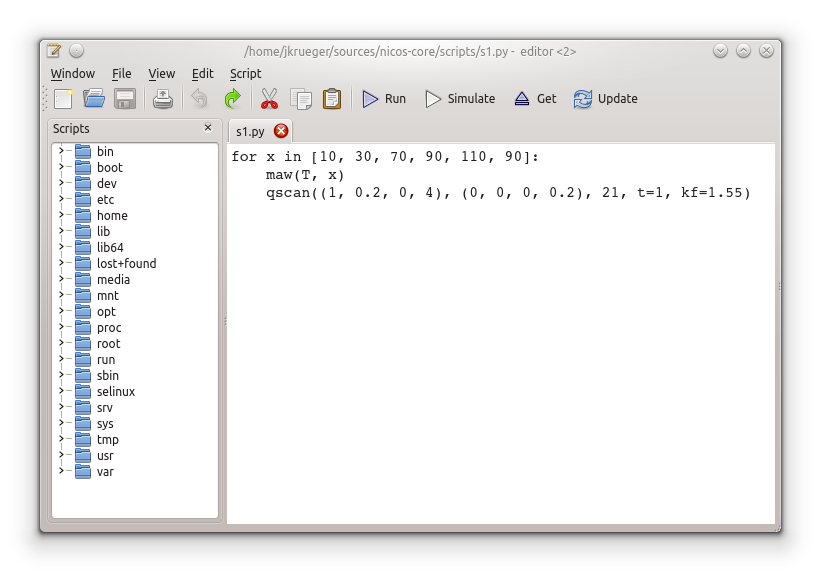

.. autoclass:: nicos.clients.gui.panels.elog.ELogPanel()

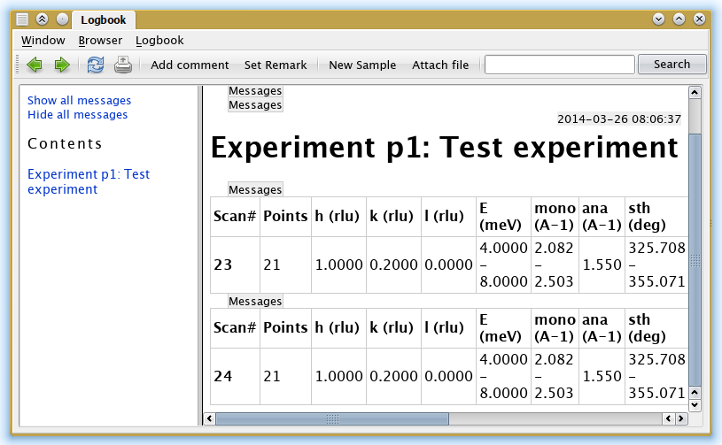

.. autoclass:: nicos.clients.gui.panels.errors.ErrorPanel()

.. figure:: errorpanel.png
     :alt: error panel
     :align: center

.. autoclass:: nicos.clients.gui.panels.expinfo.ExpInfoPanel()

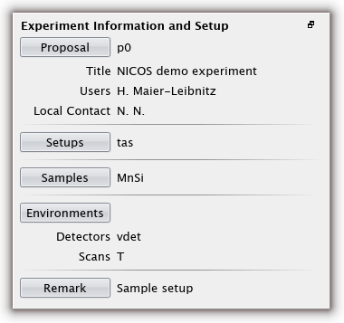

.. autoclass:: nicos.clients.gui.panels.history.HistoryPanel()

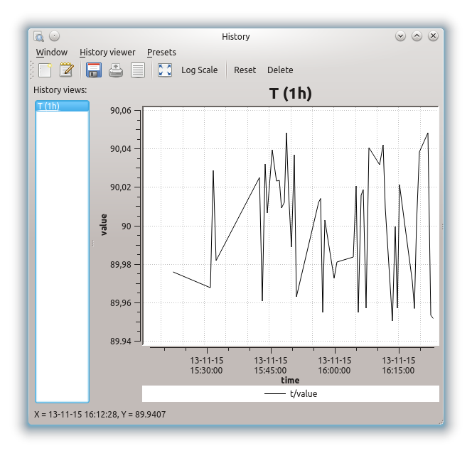

.. autoclass:: nicos.clients.gui.panels.live.LiveDataPanel()

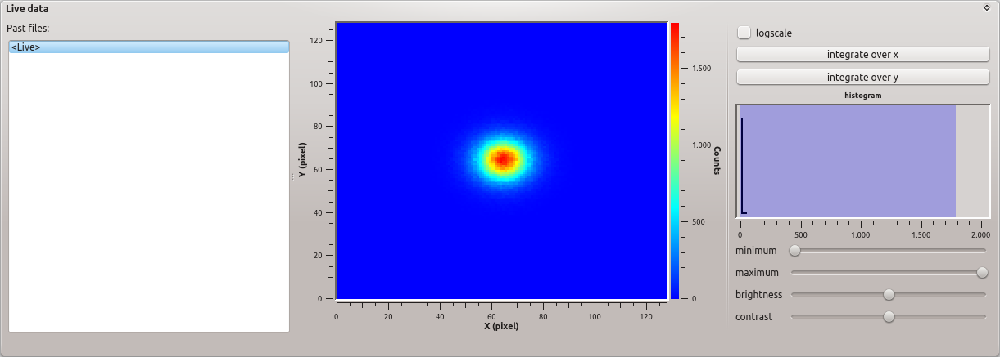

.. autoclass:: nicos.clients.gui.panels.logviewer.LogViewerPanel()

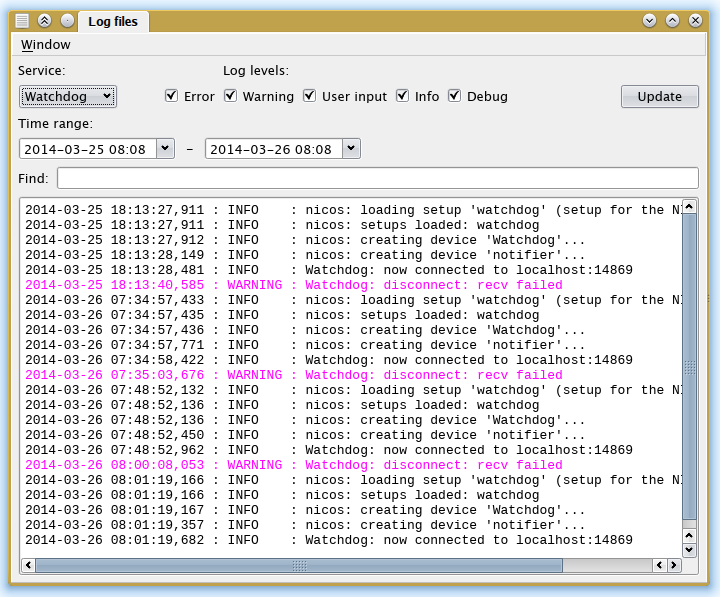

.. autoclass:: nicos.clients.gui.panels.scans.ScansPanel()

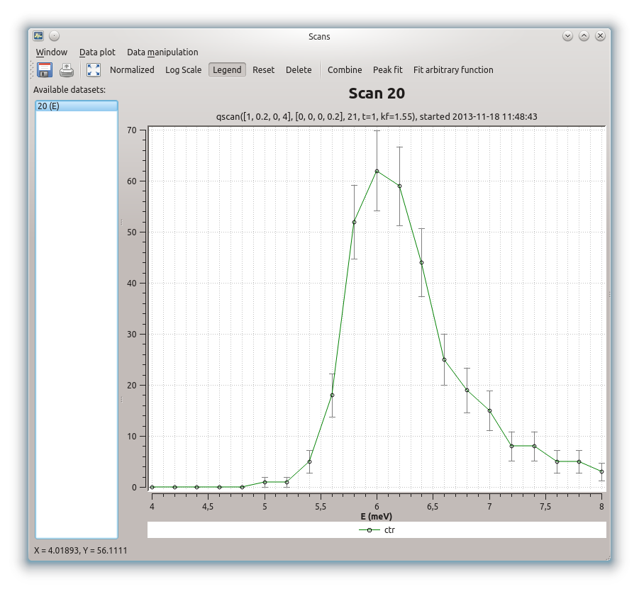

.. autoclass:: nicos.clients.gui.panels.scriptbuilder.CommandsPanel()

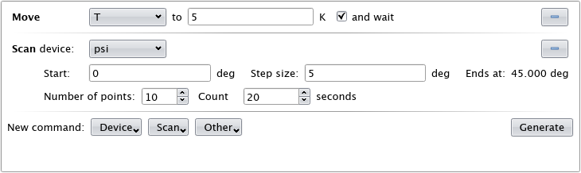

.. autoclass:: nicos.clients.gui.panels.status.ScriptStatusPanel()

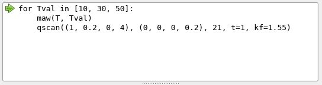

.. autoclass:: nicos.clients.gui.panels.watch.WatchPanel()

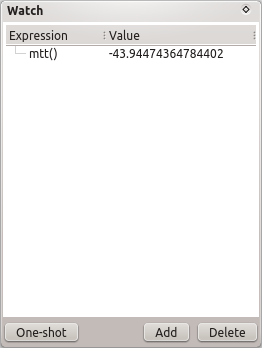

.. autoclass:: nicos.clients.gui.panels.generic.GenericPanel()

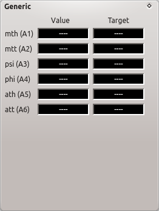

Auxiliary windows
-----------------

.. function:: window(name, icon, panelconf)

   This represents an auxiliary window.  ``name`` is the label for the window
   (and the action that opens it) and ``icon`` the name of an icon in the NICOS
   Qt resources to use for the action that opens the window.

   ``panelconf`` is the panel configuration for that window.

Tools
-----

.. function:: tool(name, classname, **options)

   This represents a tool window.  ``name`` is the label for the menu entry that
   starts the tool.

   ``classname`` must be the fully qualified name of a QDialog subclass that is
   displayed as the tool.

   ``options`` are passed to the tool as for panels.

.. function:: cmdtool(name, cmdline)

   This represents an external tool that is started with a system command.
   ``name`` is the menu entry label.

   ``cmdline`` is a list of the executable and command-line arguments, e.g.
   ``['quango', '-n', 'somehost']``.

.. function:: menu(name, *subitems)

   Represents a tool sub-menu.  The ``subitems`` are again ``tool``, ``cmdtool``
   or ``menu`` items.

Delivered tools
---------------

Tools that come with NICOS are:

.. autoclass:: nicos.clients.gui.tools.calculator.CalculatorTool()

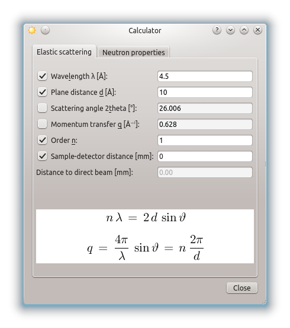

.. autoclass:: nicos.clients.gui.tools.commands.CommandsTool()

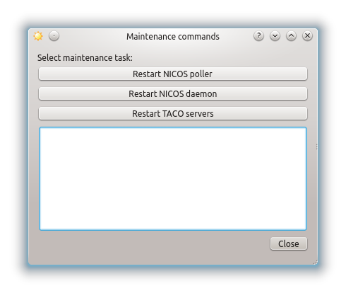

.. autoclass:: nicos.clients.gui.tools.estop.EmergencyStopTool()

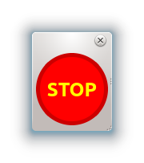

.. autoclass:: nicos.clients.gui.tools.website.WebsiteTool()

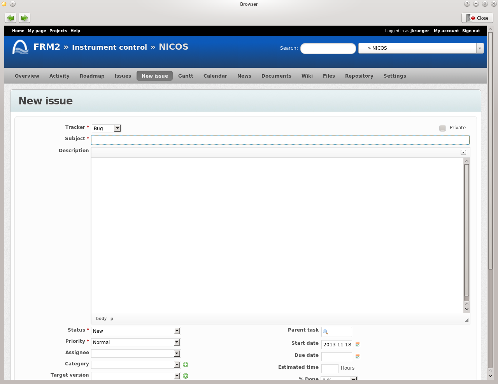
