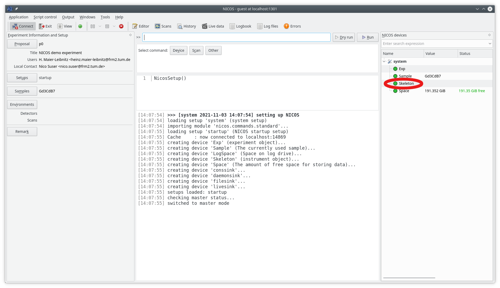
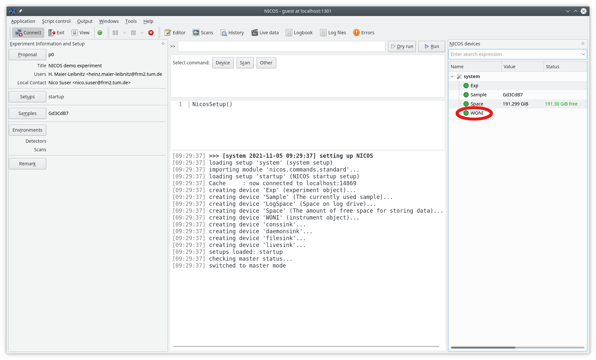
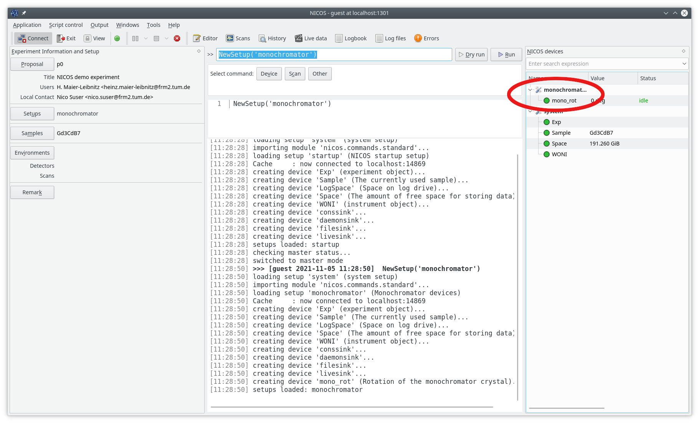
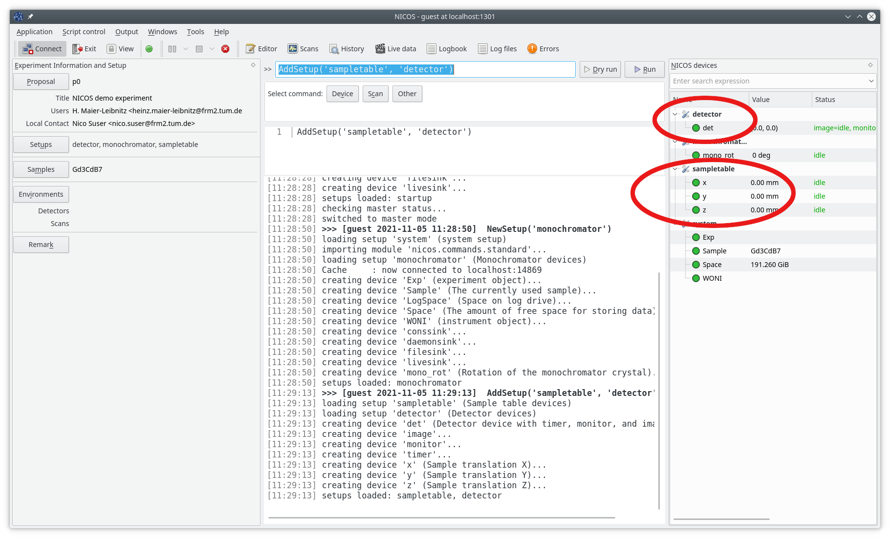
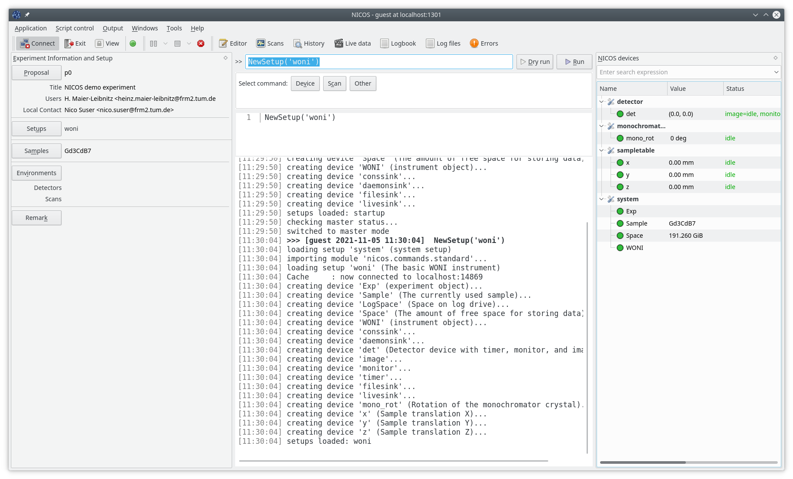

.. _setup-a-new-instrument:

Setting up NICOS for a new instrument
=====================================

This tutorial helps you to create a complete new instrument inside NICOS.

.. note::
   Please suggest additions if needed!

.. todo::

   Write how to download and preparing the sources

Preparations
------------

* Install NICOS and all pre-requisites (see: :ref:`install-nicos`).

* Check if ``bin/nicos-demo`` works.  On a machine without a desktop environment
  (e.g. a Linux server), use ``bin/nicos-demo -MT``.  If something fails here,
  you might have missed a dependency.

* If you want to be thorough, run ``make test`` and make sure any failures are
  reported.

Setting up the new instrument customization
-------------------------------------------

In the next step you will make a complete copy of the ``skeleton`` directory in
the ``nicos_demo`` directory into your facility directory.
The name of the target of the copy should be a 'self-explanatory' name of
your instrument or the instrument name itself (but in lower case letters).

If your facility is new to NICOS then you will have to first create a new
facility directory inside the NICOS source tree.  The name of the facility
directory has to be ``nicos_<facility_name>`` and must contain an empty
``__init__.py`` file.

In this tutorial the instrument is `WONI <https://manual.nexusformat.org/applying-nexus.html>`_
at the facility is ``HYNES``::

    mkdir nicos_hynes

    touch nicos_hynes/__init__.py

    cp -a nicos_demo/skeleton nicos_hynes/woni

Then change to the newly created directory (``nicos_hynes/woni``) and edit the
file ``nicos.conf``.  Please follow the instructions given in the file itself
and select the right settings.  The file uses INI-style syntax, ``#`` starts a
comment.

First change the ``setup_subdirs`` entry.  It contains a list of the directories
in the ``nicos_hynes`` directory which will be used to look for a setup name or
a device library.  Please enter the name of your previously selected directory,
e.g. ``woni`` in this tutorial.

The ``nicos.conf`` should now look like::

   # nicos.conf:
   # This file configures NICOS for a specific instrument.

   [nicos]
   # user: The system user which will own the nicos files.
   #user = nicd

   # group: The system group which will own the nicos files.
   #group = nicd

   # umask: The umask used upon creating files and directories.
   #umask = 022

   # setup_package: The Python package where to look for instrument setups.
   # The default is nicos_demo.
   setup_package = nicos_hynes

   # setup_subdirs: A list of subdir names to find setups under the custom path,
   # separated by ",".
   # Usually this is "instrumentname"
   setup_subdirs = woni

   # services: Defines which nicos services will be started by the init.d
   # script 'nicos-system' on which host (identified by the short name
   # as output by `hostname -s`)
   # * You can specify "services" alone as a configuration for all hosts.
   # * Or "services_hostname" for a specific host.
   services = cache,poller,daemon,elog,watchdog
   # services_somehost = daemon

   [environment]

   # More environment variables (including PYTHONPATH) can be defined here.

To test your configured instrument you can set the environment variable
``INSTRUMENT`` to ``nicos_<facility>.<instrument>`` (here ``nicos_hynes.woni``).

Run::

    INSTRUMENT=nicos_hynes.woni bin/nicos-demo -MO

This starts NICOS and the NICOS GUI should look like:

The ``-O`` option allows ``nicos-demo`` to run the instrument selected by the
environent variable ``INSTRUMENT``, which has been set to
``nicos_<facility>.<instrument>`` (here ``nicos_hynes.woni``).

Before you leave the system by pressing the ``Exit`` button (the window will
be closed and you will get the prompt on your terminal back), please have
a look into the right box where you will find an entry named ``Skeleton``.  This
is the device object inherited from the skeleton.  This has to be adapted to
the settings of your instrument by editing the file ``nicos_hynes/woni/setups/system.py``.
(The details of the setup file syntax are available :doc:`here <../setups>`)

Searching for the line ``devices = dict(`` you will find the following code::

    Skeleton = device('nicos.devices.instrument.Instrument',
                      description = 'instrument object',
                      instrument = 'SKELETON',
                      responsible = 'R. Esponsible <r.esponsible@frm2.tum.de>',
                      website = 'http://instrument.website',
                      operators = ['operator facility'],
                      facility = 'Your facility',
                     ),

Change the ``Skeleton`` to ``WONI`` (or your instrument name).  Adjust some
parameters to your values: ``facility``, ``website``, ``operators``, and add
the ``doi`` parameter (if a DOI for your instrument exists), see:
:class:`nicos.devices.instrument.Instrument`::

    WONI = device('nicos.devices.instrument.Instrument',
        description = 'instrument object',
        instrument = 'WONI',
        responsible = 'R. Esponsible <r.esponsible@hynes.org>',
        website = 'http://www.hynes.org/woni',
        operators = ['HYNES', 'An OtherFacility'],
        facility = 'HYNES',
    ),

The new instrument should be added to the system configuration::

    sysconfig = dict(
        ...
        instrument = 'WONI',
        ...
    )

Before starting NICOS again perform a check the syntax of the changed
setup file.  The script :ref:`check-setups <check-setups>` tool is designed
to check your newly written or modified setups::

    INSTRUMENT=nicos_hynes.woni tools/check_setup  nicos_hynes/woni/setups/system.py

If you don't get any error messages you may start NICOS again, otherwise you
have to fix the problem(s) and try the check again.

After starting NICOS again instead of the ``Skeleton`` device the ``WONI``
device is visible:

Now to complete the basic system setup in ``nicos_hynes/wone/setups/system.py``
make sure the ``dataroot`` parameter on the ``Exp`` device is set correctly,
since the data of the measurement commands will be stored there.

The basic setups for the daemons in ``nicos_hynes/woni/setups/special`` are
preconfigured in a way that the demo will run.  Normally you probably
want to replace "localhost" by the instrument specific hostname.
See :ref:`nicos-services` for more reference.

The next step is to configure the devices you need to perform the experiments
on your instrument and there is a need to create more setup files.

Let's assume that our ``WONI`` instrument will have a device to rotate the
monochromator crystal, a sample table with translations of ``x``, ``y``, and
``z``.  On top of it a rotation axis ``sample_rot`` which can be mounted.

Let's create a setup file for the monochromator device(s):
``nicos_hynes/woni/setups/monochromator.py``::

    description = 'Monochromator devices'

    group = 'lowlevel'

    devices = dict(
        mono_rot = device('nicos.devices.generic.VirtualMotor',
            description = 'Rotation of the monochromator crystal',
            abslimits = (0, 90),
            fmtstr = '%2.f',
            speed = 1,
            unit = 'deg',
        ),
    )

After checking the syntax of the configuration file and starting the ``nicos-demo``
we can load the new setup via the command::

   NewSetup('monochromator')

and we will see the device in the devices panel on the right side:

You have seen, that the setup file has an entry::

    group = 'lowlevel'

This means that this file is normally not presented to the users, see
:ref:`here <setup-group>`.

The sample table devices we put into the ``nicos_hynes/woni/setups/sampletable.py``
file::

    description = 'Sample table devices'

    group = 'lowlevel'

    devices = dict(
        x = device('nicos.devices.generic.VirtualMotor',
            description = 'Sample translation X',
            abslimits = (-100, 100),
            fmtstr = '%.2f',
            speed = 1,
            unit = 'mm',
        ),
        y = device('nicos.devices.generic.VirtualMotor',
            description = 'Sample translation Y',
            abslimits = (-100, 100),
            fmtstr = '%.2f',
            speed = 1,
            unit = 'mm',
        ),
        z = device('nicos.devices.generic.VirtualMotor',
            description = 'Sample translation Z',
            abslimits = (0, 100),
            fmtstr = '%.2f',
            speed = 0.5,
            unit = 'mm',
        ),
    )

And for the detector we put its configuration into
``nicos_hynes/woni/setups/detector.py``::

    description = 'Detector devices'

    group = 'lowlevel'

    devices = dict(
        timer = device('nicos.devices.generic.VirtualTimer',
            lowlevel = True,
        ),
        monitor = device('nicos.devices.generic.VirtualCounter',
            lowlevel = True,
            type = 'monitor',
            countrate = 100,
        ),
        image = device('nicos.devices.generic.VirtualImage',
            lowlevel = True,
            sizes = (80, 256),
        ),
        det = device('nicos.devices.generic.Detector',
            description = 'Detector device with timer, monitor, and image',
            timers = ['timer'],
            monitors = ['monitor'],
            images = ['image'],
        ),
    )

If you look into the configurations of the ``timer``, ``monitor``, and ``image``
devices you'll see that the ``lowlevel`` configuration parameters are set to
``True``.  This hides these devices from the user, because the user does not
need to see all possible devices.  At the end the user would be confused due
to the high number of devices.  You will see as well that all devices are
attached to the ``det`` device which is the final detector device.

After checking the syntax the setups may be loaded by::

     AddSetups('sampletable', 'detector')

To avoid having to load the three setups again and again, NICOS allows
including setups within other setups.  The ``nicos_hynes/woni/setups/woni.py``
shows how to make it::

    description = 'The basic WONI instrument'

    group = 'basic'

    includes = ['monochromator', 'sampletable', 'detector']

If this setup is used in the ``NewSetup`` command, then all three previous
setups will be loaded.

As you see we are using the group ``basic`` here.  The mechanism of including
other setups into a setup file is not restricted to files of this group.  For
more information see: :ref:`setups`:

.. warning::

   If you are using the ``includes`` extensively be careful that you
   don't create circular includes

Do you remember, that we haven't created the sample rotation device?  This will
follow now.  We create a separate setup ``nicos_hynes/woni/setups/samplerot.py``::

    description = 'Sample rotation device'

    group = 'optional'

    devices = dict(
        sample_rot = device('nicos.devices.generic.VirtualMotor',
            description = 'Sample rotation',
            abslimits = (-720, 720),
            speed = 1,
            unit = 'deg',
            fmtstr = '%1.f',
        ),
    )

As you can see, this setup belongs to the 'optional' group.  This type of
setup can be loaded by the user when they are needed, in our case if the sample
rotation device is mounted on the sample table.

.. figure:: images/nicos-step6.png

.. note::

   Do not hesitate to refer to other instruments' setup files for that!

GUI configuration
-----------------

A custom GUI config file is available under ``nicos_hynes/woni/guiconfig.py``,
see :ref:`gui-config`.

Custom GUI modules (e.g. Panels) should go under ``nicos_hynes/woni/gui`` to be
importable under ``nicos_hynes.woni.gui``.

Adding setups and libraries
---------------------------

Setups can be created in ``nicos_<facility>/<instrument>/setups`` (in our case
``nicos_hynes/woni/setups``).  Modules for devices go under
``nicos_<facility>/<instrument>/devices`` (e.g. ``nicos_hynes/woni/devices``).

Modules like ``nicos_hynes/woni/devices/foo.py`` can be imported as
``nicos_hynes.woni.devices.foo``.

.. todo::

   facility wide used libraries are stored in ``nicos_<facility>/devices``

Building and installing
-----------------------

Now you can do an installation with::

    make install PREFIX=<installation_path> INSTRUMENT=nicos_<facility>.<instrument>

Check the generated ``$PREFIX/nicos.conf`` for obvious errors and adapt it.
See :ref:`nicosconf` for a description.

Starting/Stopping of services
-----------------------------

Systemd integration
^^^^^^^^^^^^^^^^^^^

If you want to integrate with systemd create a symlink to
``$PREFIX/etc/nicos-late-generator`` in ``/lib/systemd/scripts`` and symlinks to
``$PREFIX/etc/nicos-late-generator.service`` and ``$PREFIX/etc/nicos.target``
in ``/lib/systemd/system``.  Then, run ``systemctl enable
nicos-late-generator.service``.  See :ref:`sys-startup`.

Init V integration
^^^^^^^^^^^^^^^^^^

If you want the init script to be recognized by the system, create a symlink
to ``$PREFIX/etc/nicos-system`` in ``/etc/init.d``.  Similarly, you can add
``$PREFIX/bin`` to ``$PATH``, or create links to them somewhere in ``$PATH``,
e.g. ``/usr/local/bin``.  Check if the init script works with
``/etc/init.d/nicos-system start``.

Push back code to repository
----------------------------

We strongly recommend to save your configuration into the central NICOS
repository for two reasons:

 - The (other) NICOS developers can view your configurations, devices,
   commands, panel, etc. and may be able to give you feedback and hints on how
   to make it (more) NICOS-like.

 - If the NICOS developers make significant core changes, then they are able
   to see possible conflicts or problems very early and may make the necessary
   adaptions of your settings for you

Commit your code changes and push to gerrit (or use ``git format-patch
origin/master`` or ``origin/release-X.Y`` and commit/push the patches on a
machine where you have your public key).  Instruct instrument people to always
change the files in the checkout and commit them.

.. _git: https://git-scm.com
.. _using-mlz-gerrit: https://forge.frm2.tum.de/wiki/services:gerrit:using_git_gerrit
