************************
Cache Inspector Usage
************************

.. contents::

Close the Cache Inspector Window
--------------------------------

The |CI| has 3 general interface items to close the window.

1. Use the 'x' at the top right.

.. image:: screenshots/close1.png

2. Use the *Quit* option in the tool box.

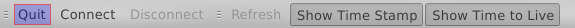

3. Use the *Quit* option in the *Client* menu.

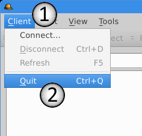

Connect to a server
-------------------

If the |CI| has disconnected, lost connection, or couldn't connect on start-up
there is an option to connect to the same or another server. Again there are
several ways to do this.

One way is to close the program and invoke the program again. This option is not
recommended as there are better alternatives.

At the top left corner of the |CI| click the menu *Client*. Now click on
*Connect...*.

.. image:: screenshots/connect1.png

Alternatively you can use the *Connect* button in the tool box.

.. image:: screenshots/connect2.png

A dialog will pop up with a form.

.. image:: screenshots/dialogConnect.png

1. Here we will in the IP address or hostname of a server. By default it will
   name the localhost (127.0.0.1)

2. Here we fill in the port which we will use to connect to the server. By
   default this one will name 14869.

3. Now if we're okay with the IP address and port we click ok to accept and
   connect to the server.

4. However if we do not want to connect we can cancel with this button which
   will close the dialog without connecting to a server.

If the |CI| has already established a connection both the menu
and tool box option are grayed out.

On a side note if everything has been done correctly these buttons should be
grayed out as well.

.. image:: screenshots/connectGrayedOut1.png
.. image:: screenshots/connectGrayedOut2.png

Disconnect from a server
------------------------

To disconnect from the current server for example to establish a new connection
without having to restart the program you have to options again.

Via the menu:
Use the *Disconnect* option in the *Client* menu.

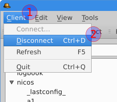

Via the toolbox:
Use the option shown in the tool box

.. image:: screenshots/disconnect2.png

Via shortcut:
Alternatively you can use the keyboard short-cut control and "D".

The disconnect options toggle just like the connect options but inverted.
When the |CI| has not established a connection you cannot disconnect.

So if you are not connected yet both disconnect options will be grayed out:

.. image:: screenshots/disconnectGrayedOut1.png
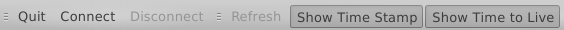

Cache Tree
----------

The cache tree seen on the left side of the window works like a file system.
Nodes represent the folders and in the folders you can have more folders. Nodes
marked with an arrow can be expanded and collapsed.

.. image:: screenshots/cacheTree.png

1. A node
2. The collapse/expand arrow
3. A node for low level keys (keys without a node)
4. The scrollbar to scroll through the keys

The key and values will be shown on the right side whenever a node has been
selected.

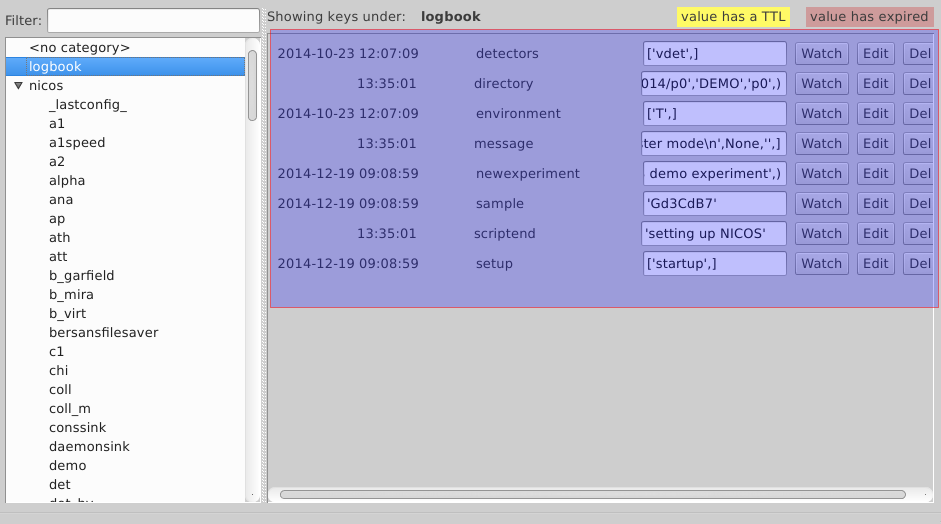

Nodes do not always have keys. When a node is selected in the top middle it will
show full node or category name included in the keys path.

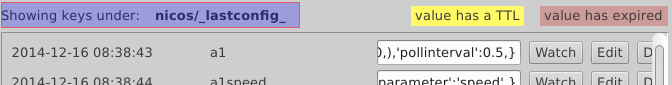

Example for nodes without keys:

::

    example/project/inspector/version=2.7

::

    example/project/inspector/name="Inspector Gadget"

::

    example/date="2014-12-17"

In this case project will not show any keys in the |CI|.

.. image:: screenshots/nodeWithoutKeys.png

View Keys
---------

Once a node has been selected in the cache tree the respective keys and values
will be shown on the right side. As default the time stamp and time to live are
shown as well.

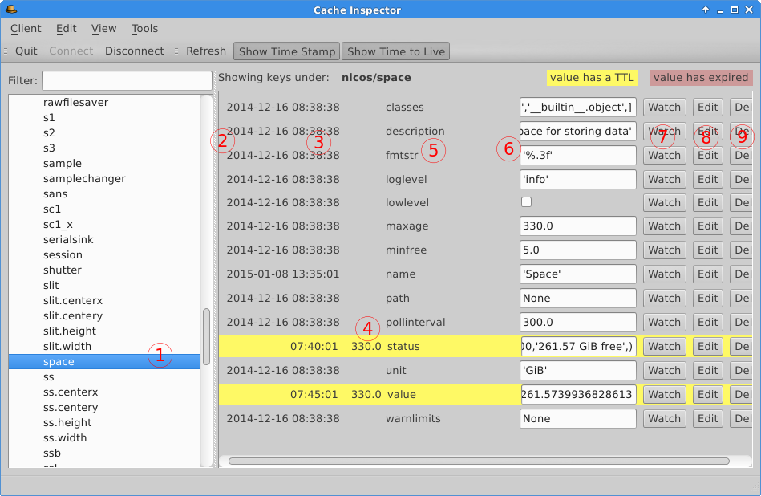

1. The selected node which we want to view the keys from.

2. The date of the `time stamp`_ (visible by default)

3. The time of the `time stamp`_ (visible by default)

.. _time stamp: `Time Stamp & Time to Live`_

4. The `time to live` (visible by default)

.. _time to live: `Time Stamp & Time to Live`_

5. The name of the key. In this example the name is fmtstr that means the
   path would be ``nicos/space/fmtstr``

6. The value of the key. In this example the key/value entry would be
   ``nicos/space/fmtstr='%.3f'``

7. A button to add the key to the `Watcher`_

.. _Watcher: `How to Use the Watcher`_

8. A button to `edit`_ the key

.. _edit: `Edit Values of Keys`_

9. The button to `delete`_ the given key.

.. _delete: `Delete a Key`_

When a key-value is marked yellow it means that this key has a time to live.

.. image:: screenshots/keyMarkedYellow.png

If the time to live is exceeded the key will either expire or auto-update. If
the key is marked red it means the time to live has exceeded but the key wasn't
refreshed or updated. Alternatively it can also mean the key has been deleted
(expired via deletion).

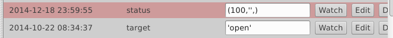

This is also mentioned in the top right of the window:

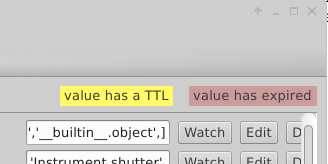

View the Full Value of a Key
----------------------------

Sometimes the value is greater than the field they're in.

By clicking into the field holding the mouse button down...

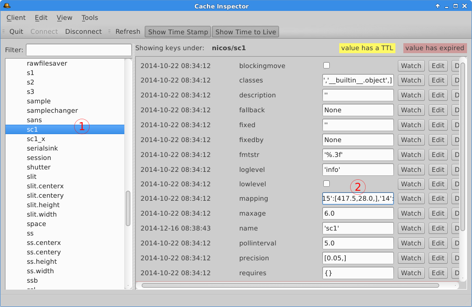

...and moving the mouse into the direction where a part of the value is missing

1. left to get to the beginning

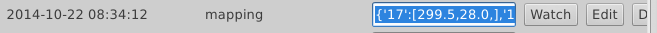

2. right to get to the end

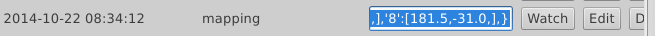

this will scroll through the value to allow seeing the respective part. The
`Watcher`_ can be used as an alternative to this due to it's flexible nature and
minimal GUI elements.

Time Stamp & Time to Live
-------------------------

**Time Stamp** and **Time to Live** are shown on default however as they're not a
necessity you can simply toggle them by either clicking the respective buttons
in the tool box

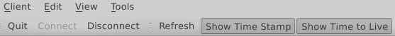

or toggling them in the "View" menu tab.

.. image:: screenshots/timeStampAndTTLEnabledMenu.png

**Time Stamp** and or **Time to Live** are disabled or hidden when they have no tick
in front of their menu options or if they're buttons aren't marked darker than
the rest of the tool box.

Both enabled:

.. image:: screenshots/timeStampAndTTLEnabledMenu.png

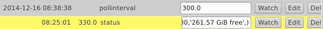

**Time Stamp** disabled, **Time to Live** enabled:

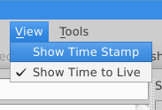

.. image:: screenshots/TTLEnabledToolBox.png

.. image:: screenshots/TTLEnabledKeyValue.png

**Time Stamp** enabled, **Time to Live** disabled:

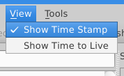

.. image:: screenshots/timeStampEnabledToolBox.png

.. image:: screenshots/timeStampEnabledKeyValue.png

Both disabled:

.. image:: screenshots/timeStampAndTTLDisabledMenu.png

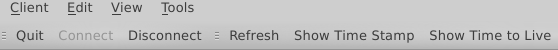

.. image:: screenshots/timeStampAndTTLDisabledKeyValue.png

The Refresh Feature
-------------------

When new keys are added without the use of the |CI| they don't show up in the
cache tree. To see them in the cache tree it requires to be refreshed manually.
This can be done in 3 different ways.

1. Using the option in the *Client* menu.

.. image:: screenshots/menuRefresh.png

2. Using the option in the tool box.

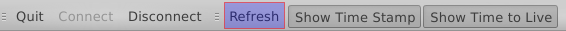

3. Using the *F5* key on the keyboard.

Edit Values of Keys
-------------------

To edit a key's information such as values click the *Edit* button on the
respective key.

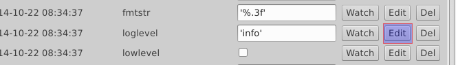

A dialog will pop up giving you all options you need when editing a key.

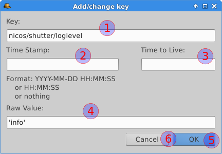

1. The name and position of the key. (This cannot be changed)

2. The **Time Stamp**. It needs to be given in the said format YYYY-MM-DD HH:MM:SS
   or HH:MM:SS or left empty.

3. The **Time to Live**. This should be a float number and can also be left empty.

4. The actual value of the key. This can be any python data type.

5. With the *OK* button we approve of the change and it will be done.

6. With the *Cancel* button we can discard any changes and close the dialog.

Examples for data types:

Int:
 * 24

Float:
 * 1.4

Double:
 * 6.66333111

String:
 * 'Inspector Gadget'
 * "Inspector Gadget"

Boolean:
 * True
 * False

Add a Key
---------

The option to add a key can be found in the menu "Edit".

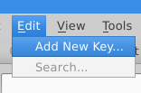

This will open a similar window to the one seen in `Edit Values of Keys`_.
The difference is that a key can be given in the field below the label "Key:".
The rest is the same like `editing keys`_.

.. _editing keys: `Edit Values of Keys`_

1. The name and position of the key.
   Example:

   ::

        example/cacheInspector/key

   This would create a node "cacheInspector" in the node "example".

2. The **Time Stamp** needs to be given in the said format YYYY-MM-DD HH:MM:SS
   or HH:MM:SS or left empty.

3. The **Time to Live**. This should be a float number and can also be left empty.

4. The actual value of the key. This can be any python data type.

5. With the *OK* button we approve and the new key will be added.

6. With the *Cancel* button we can close the dialog without creating a new key.

Delete a Key
-------------

The last button at the very right side of the window called "Del" is
there to delete the key.

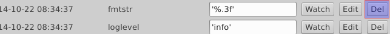

Clicking the button will open a prompt asking if the key should be deleted.

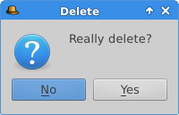

Selecting *No* will close the prompt without further changes. (default)

However selecting *Yes* will mark the key as expired and delete it's value.

Keep in mind that keys cannot be removed from the cache via |CI| and they're not
supposed to. (See `NICOS Cache Documentation`_)

.. Insert intern link to NICOS Cache Documentation here.

How to Use the Watcher
----------------------

The watcher is an extra window where keys can be added to from throughout all
nodes and categories. This is useful when you want to compare several keys from
different nodes or if you want to keep an eye on a certain key.

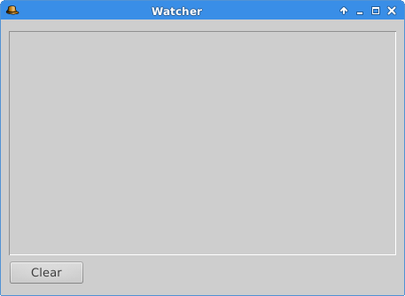

The watcher window can be opened by using the "Watcher" option in the *Tools* menu.

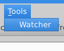

It also automatically opens whenever a key is added to the watcher.

Add keys to the Watcher
-----------------------

This is done via the "Watch" button included as the first button of the three on
the very right of the |CI|. The watch button adds the key it belongs to to the
watcher.

.. image:: screenshots/addKeyToWatcher.png

This will achieve the following.

.. image:: screenshots/keyToWatcherResult.png

Remove keys from the watcher.
-----------------------------

As of now it's not possible to remove a single key from the watcher. The clear
button removes all keys that are currently in the watcher window.

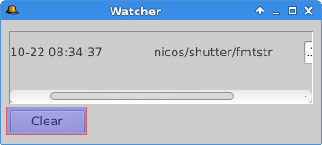

How to Use the Filter
---------------------

The filter can be used to filter the nodes/categories by the text given.

.. image:: screenshots/filter.png

Example:

Filtering for "nicos" will only show nodes having a node on a lower level called
or including "nicos" and all of this one's lower level keys. All keys that do
not have "nicos" in one of their parent nodes or child nodes or child keys will
be omitted.

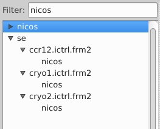
